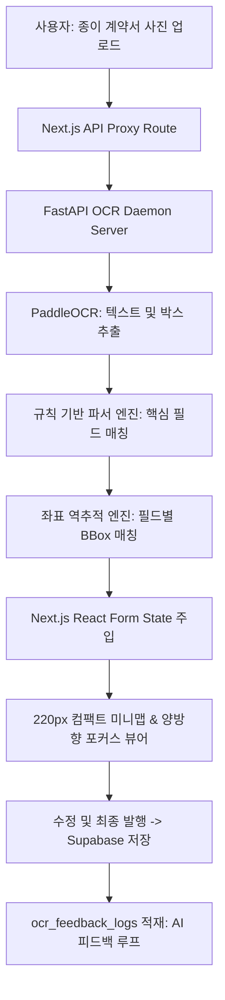

# 계약서 OCR 자동완성 및 인터랙티브 하이라이트 시스템 사양서
> 최종 업데이트: 2026-07-10 | PAZAB v2 (`C:\pazabv2\plan\contract_ocr_specification.md`)

이 문서는 파잡(PAZAB) v2 플랫폼에 구현된 종이 근로계약서 사진 기반 **OCR 규칙 파서 엔진** 및 **프론트엔드 인터랙티브 하이라이팅(Bounding Box) 연동 사양**과 **향후 발전 로드맵**을 상세 기술합니다.

---

## 1. 시스템 아키텍처 및 흐름

---

## 2. 현재 완료된 기능 명세 (Current Milestones)

### ① 규칙 기반 파서 알고리즘 고도화
* **X/Y축 기하 정렬 (`find_right_neighbor`)**: 
  * OCR 검출 시 단어가 여러 조각으로 쪼개지는 현상을 방지하기 위해, Y축 임계값(±10px) 내에서 X축 상 바로 우측에 위치한 텍스트 상자들을 하나의 의미 단위로 병합 정렬합니다.
* **노이즈 필터링 클렌징**:
  * 시급 필드 검출 시 금액 옆에 붙는 쉼표(`,`), 원(원), 한글 노이즈 등을 제거하고, 날짜/전화번호/사업자번호와 혼동되는 숫자를 정규식 패턴으로 격리하여 순수 임금 정보만 90% 이상의 높은 정확도로 낚아챕니다.

### ② 정밀 BBox 좌표 역추적 (Coordinate Recovery)
* **순방향 부분 일치 매핑**:
  * 최종 파싱된 데이터(예: `"20000"`, `"홍길동"`)의 실제 글자가 위치한 원래 박스를 PaddleOCR 결과군에서 역추적하여 최소/최대 좌표 `[x_min, y_min, x_max, y_max]`를 산출합니다.
  * 단자리 숫자조각이나 파편 단어에 의해 엉뚱한 곳으로 쏠리던 역방향 조건(`clean_txt in clean_val`)을 차단하여, 시급·주소·생년월일·전화번호 등 모든 핵심 필드가 본인의 진짜 좌표를 가리키게 교정했습니다.

### ③ 모바일 극대화 UX 튜닝 (Mobile Optimization)
* **220px 컴팩트 뷰어 (Minimap)**:
  * 모바일 화면에서 세로로 거대하게 늘어나던 이미지를 높이 `220px` 안에 맞추고 가로세로 비율을 유지하여 스크롤 압박을 근본적으로 해소했습니다. BBox들 역시 미니맵 비율에 맞춰 완벽히 축소 매핑됩니다.
* **양방향 포커스 싱크 (Highlight Sync)**:
  * 사용자가 폼 필드(예: 시급 입력창)를 터치하거나 활성화하면, 이미지 위 해당 좌표 영역의 테두리가 선명한 보라색 하이라이트 박스(Pulse 그림자 애니메이션 포함)로 강조되어 출처를 1:1 대조하게 돕습니다.
* **아코디언 접기 토글**:
  * `[▲ 접기] / [▼ 펼치기]` 스위치를 통해 이미지 영역을 접어두고 입력창에 완전히 포커스할 수 있는 화면 시야를 제공합니다.
* **가상 키보드 가림 회피**:
  * 모바일 뷰포트에서 가상 키보드가 전개되었을 때 뷰어가 키보드에 덮여 가려지지 않도록 모바일에서만 **[상단: 미리보기] ➡️ [하단: 입력 폼]** 으로 Flex 배치 방향을 반전(`column-reverse`)시켰습니다.
* **Lightbox 줌-인 확대 모달**:
  * 컴팩트 미리보기를 탭하면, 화면 전체를 어두운 암전 레이어로 덮는 확대 팝업이 열려 또렷하게 실물 원본 대조가 가능합니다.

---

## 3. 향후 발전 및 진행 계획 (Next Steps & AI Loop)

### ① AI 피드백 루프 구축 (`ocr_feedback_logs` 연동)
* **목적**: 룰 파서가 오인식한 항목과 사용자가 최종 수정한 데이터의 불일치 내역을 모니터링하고, 향후 PaddleOCR 및 파인튜닝 모델의 지도 학습 데이터셋으로 정제합니다.
* **데이터 적재 스키마 (`ocr_feedback_logs` 테이블)**:
  * `original_parsed_data` (JSONB): 최초 OCR 서버가 파싱하여 반환한 원본 데이터 딕셔너리
  * `final_saved_data` (JSONB): 사용자가 최종 검증 및 수정한 후 Supabase에 저장한 데이터 딕셔너리
  * `discrepancies` (JSONB): 불일치가 일어난 필드 목록 및 오차 내역
  * `image_storage_url` (Text): 검증 실패 사례 재검출용 원본 계약서 이미지 Storage 경로

### ② 비표준 계약서 대응 및 AI Fallback 레이어 확장
* 현재 규칙 기반 파서는 정제된 **'표준근로계약서 5종 양식'**에 맞춰 최고 성능을 발휘하도록 최적화되어 있습니다.
* **발전 방향**:
  * 룰 기반 매칭이 완전히 실패(검출 성공 필드가 3개 이하)하거나 신뢰도가 떨어지는 비표준 양식에 대비하여, 백그라운드에서 LLM 비동기 Fallback 파싱 스크립트를 경량 가동합니다.
  * PaddleOCR에서 검출된 전체 Text Block 목록을 프롬프트와 함께 LLM에 주입하여 의미론적(Semantic)으로 계약 조건을 정밀 추출하고 피드백 루프 데이터셋에 병합하는 기술을 탑재할 예정입니다.
